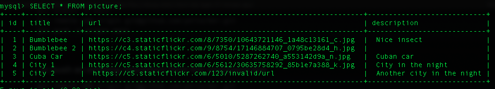

# README

## Tools
- MySql version >= 5.7
- PHP 7.4.13
- Symfony 5.2.3

## Make it work
To create DB (named csvs)
```bash
% php bin/console doctrine:database:create

$ php bin/console make:migration
$ php bin/console doctrine:migrations:migrate
```

POSTing data
```bash
% curl -L --data-binary @<file_name.csv> http://localhost:8000/curlupload -H 'Content-Type: text/csv'
```
Example
```bash
% curl -L --data-binary @images_data.csv http://localhost:8000/curlupload -H 'Content-Type: text/csv'
```

Get json with all the data
```bash
% curl -L http://localhost:8000/picturesalldata
```

Get picture
```bash
% curl -v -L http://localhost:8000/picturefile/1 --output foto.jpg
```

Get json with the details of one picture
```bash
% curl -L http://localhost:8000/picturedetails/1
```

## Test DB
```sql
CREATE DATABASE csvs_test;
```
```sql
CREATE TABLE `picture` (
  `id` int NOT NULL AUTO_INCREMENT,
  `title` varchar(255) COLLATE utf8mb4_unicode_ci NOT NULL,
  `url` varchar(255) COLLATE utf8mb4_unicode_ci NOT NULL,
  `description` varchar(255) COLLATE utf8mb4_unicode_ci DEFAULT NULL,
  PRIMARY KEY (`id`)
)
```


